# Prix Six - Entity Relationship Diagram

## Overview
This document describes the Firestore data model for the Prix Six F1 Prediction League application.

---

## ER Diagram (Mermaid)

```mermaid
erDiagram
    USERS ||--o{ PREDICTIONS : "has"
    USERS ||--o{ LEAGUES : "member of"
    USERS ||--o{ AUDIT_LOGS : "generates"
    USERS ||--o{ SCORES : "earns"
    USERS ||--|| PRESENCE : "has"
    USERS ||--o| EMAIL_VERIFICATION_TOKENS : "has"

    LEAGUES ||--o{ USERS : "contains"

    RACES ||--o{ RACE_RESULTS : "produces"
    RACES ||--o{ PREDICTIONS : "receives"

    RACE_RESULTS ||--o{ SCORES : "generates"

    DRIVERS }|--o{ PREDICTIONS : "selected in"
    DRIVERS }|--o{ RACE_RESULTS : "placed in"

    USERS {
        string id PK "Firebase Auth UID"
        string email
        string teamName
        boolean isAdmin
        string secondaryTeamName
        boolean mustChangePin
        number badLoginAttempts
        object emailPreferences
        boolean emailVerified
        number points
        timestamp createdAt
    }

    PREDICTIONS {
        string id PK "teamId_raceId"
        string userId FK
        string teamId
        string teamName
        string raceId FK
        string raceName
        array predictions "6 driver IDs"
        timestamp submittedAt
    }

    RACES {
        string id PK "race-name-slug"
        string name
        string qualifyingTime
        string sprintTime
        string raceTime
        string location
        boolean hasSprint
    }

    RACE_RESULTS {
        string id PK "race-slug-gp/sprint"
        string raceId FK
        string raceName
        string driver1 FK
        string driver2 FK
        string driver3 FK
        string driver4 FK
        string driver5 FK
        string driver6 FK
    }

    SCORES {
        string id PK "resultDocId_userId"
        string userId FK
        string raceId FK
        number totalPoints
        string breakdown
        timestamp createdAt
    }

    DRIVERS {
        string id PK "driver-slug"
        string name
        number number
        string team
        string imageId
    }

    LEAGUES {
        string id PK
        string name
        string ownerId FK
        array memberUserIds "FK to users"
        boolean isGlobal
        string inviteCode
        timestamp createdAt
        timestamp updatedAt
    }

    PRESENCE {
        string id PK "userId"
        boolean online
        array sessions
        object sessionActivity
        timestamp lastActivity
    }

    AUDIT_LOGS {
        string id PK
        string userId FK
        string action
        object details
        string correlationId
        timestamp timestamp
    }

    EMAIL_VERIFICATION_TOKENS {
        string id PK "userId"
        string token
        string email
        timestamp expiresAt
        timestamp createdAt
        boolean used
    }

    APP_SETTINGS {
        string id PK "setting-name"
        boolean isLocked
        boolean hotNewsFeedEnabled
        string content
        timestamp lastUpdated
    }

    ADMIN_CONFIGURATION {
        string id PK "config-name"
        boolean masterEnabled
        boolean testMode
        string targetGroup
        object alerts
        timestamp lastUpdated
        string updatedBy
    }

    WHATSAPP_QUEUE {
        string id PK
        string message
        string groupId
        string targetGroup
        string status
        timestamp createdAt
        timestamp processedAt
        string error
    }

    EMAIL_QUEUE {
        string id PK
        string toEmail
        string subject
        string htmlContent
        string type
        string teamName
        timestamp queuedAt
        string status
        string reason
    }

    EMAIL_LOGS {
        string id PK
        string toEmail
        string subject
        string type
        string emailGuid
        string status
        timestamp timestamp
    }

    ERROR_LOGS {
        string id PK
        string userId FK
        string error
        string correlationId
        string stackTrace
        object context
        timestamp timestamp
    }
```



---

## Collection Relationships

### Core Data Flow

```
┌─────────────┐     predicts      ┌─────────────┐
│   USERS     │──────────────────▶│ PREDICTIONS │
│             │                   │             │
│  - teamName │                   │ - 6 drivers │
│  - email    │                   │ - raceId    │
└─────────────┘                   └──────┬──────┘
       │                                 │
       │ earns                           │ for
       ▼                                 ▼
┌─────────────┐     based on      ┌─────────────┐
│   SCORES    │◀──────────────────│   RACES     │
│             │                   │             │
│ - points    │                   │ - schedule  │
│ - breakdown │                   │ - hasSprint │
└─────────────┘                   └──────┬──────┘
       ▲                                 │
       │ calculated from                 │ produces
       │                                 ▼
       │                          ┌─────────────┐
       └──────────────────────────│RACE_RESULTS │
                                  │             │
                                  │ - top 6     │
                                  └─────────────┘
```

### League System (Lens Architecture)

```
┌─────────────────────────────────────────────────────┐
│                    LEAGUES                          │
│  ┌─────────────┐  ┌─────────────┐  ┌─────────────┐ │
│  │   Global    │  │  Private 1  │  │  Private 2  │ │
│  │ (all users) │  │ (subset)    │  │ (subset)    │ │
│  └─────────────┘  └─────────────┘  └─────────────┘ │
└─────────────────────────────────────────────────────┘
                         │
                         │ filters view of
                         ▼
┌─────────────────────────────────────────────────────┐
│              STANDINGS / SCORES / RESULTS           │
│         (same data, filtered by memberUserIds)      │
└─────────────────────────────────────────────────────┘
```

---

## Collection Categories

### 1. Core Game Data
| Collection | Purpose | Access |
|------------|---------|--------|
| `users` | Player profiles and settings | Owner + Admin |
| `users/{id}/predictions` | Race predictions (subcollection) | Owner + Signed-in (read) |
| `races` | Race schedule and metadata | Public read, Admin write |
| `race_results` | Official race results (top 6) | Server-side only |
| `scores` | Calculated points per race | Server-side only |
| `drivers` | F1 driver information | Public read, Admin write |

### 2. League System
| Collection | Purpose | Access |
|------------|---------|--------|
| `leagues` | Private/global leagues | Members + Admins |

### 3. User Session & Presence
| Collection | Purpose | Access |
|------------|---------|--------|
| `presence` | Online status & active sessions | Owner + Signed-in |
| `email_verification_tokens` | Email verification tokens | Server-side only |

### 4. Audit & Logging
| Collection | Purpose | Access |
|------------|---------|--------|
| `audit_logs` | User action tracking | Owner create, Admin read |
| `error_logs` | Application errors | Signed-in create, Admin read |

### 5. Communication
| Collection | Purpose | Access |
|------------|---------|--------|
| `whatsapp_queue` | Pending WhatsApp messages | Server-side only |
| `whatsapp_alert_history` | Sent WhatsApp alerts | Server-side write, Admin read |
| `email_queue` | Pending emails | Server-side only |
| `email_logs` | Sent email history | Server-side write, Admin read |
| `email_daily_stats` | Daily email statistics | Server-side only |
| `mail` | Legacy mail trigger | Server-side only |

### 6. Configuration
| Collection | Purpose | Access |
|------------|---------|--------|
| `app-settings` | App-wide settings (hot news, etc.) | Public read, Admin write |
| `admin_configuration` | Admin-only config | Admin only |

---

## Key Design Patterns

### 1. Subcollections for User Data
Predictions are stored as subcollections under users (`users/{userId}/predictions/{predictionId}`) to:
- Enable efficient per-user queries
- Support collection group queries for cross-user aggregation
- Maintain clear ownership boundaries

### 2. Denormalized Team Names
`teamName` is stored in both `users` and `predictions` documents to:
- Enable efficient display without joins
- Reduce read operations in leaderboards

### 3. Server-Side Protected Collections
`race_results`, `scores`, and `email_verification_tokens` use Admin SDK only to:
- Prevent score manipulation
- Ensure data integrity
- Handle sensitive operations securely

### 4. Lens-Based Filtering
Leagues act as filters (not data duplication):
- All scores/standings come from same `scores` collection
- `selectedLeague.memberUserIds` filters the view client-side
- No data duplication across leagues

---

## Document ID Conventions

| Collection | ID Format | Example |
|------------|-----------|---------|
| `users` | Firebase Auth UID | `abc123xyz789` |
| `predictions` | `{teamId}_{raceId}` | `user123_Australian-Grand-Prix` |
| `races` | Race name slug | `Australian-Grand-Prix` |
| `race_results` | `{race-slug}-{gp\|sprint}` | `australian-grand-prix-gp` |
| `scores` | `{resultDocId}_{userId}` | `australian-grand-prix-gp_user123` |
| `drivers` | Driver name slug | `verstappen` |
| `leagues` | Auto-generated or `global` | `global`, `abc123` |
| `presence` | User ID | `abc123xyz789` |

---

*Generated: January 2026 | Version: 1.19.0*
