# Prix Six - Entity Relationship Diagram

## Mermaid ER Diagram

```mermaid
erDiagram
    %% ═══════════════════════════════════════════════════════════════
    %% MODULE: USER MANAGEMENT
    %% ═══════════════════════════════════════════════════════════════

    users {
        string id PK "Firebase Auth UID"
        string email UK "User email address"
        string teamName UK "Primary team name"
        string secondaryTeamName "Optional second team"
        boolean isAdmin "Admin flag"
        boolean mustChangePin "Force PIN reset"
        number badLoginAttempts "Failed login counter"
        object emailPreferences "Notification settings"
        timestamp createdAt
        timestamp updatedAt
    }

    emailPreferences {
        boolean rankingChanges "Ranking update emails"
        boolean raceReminders "Race event emails"
        boolean newsFeed "Hot news emails"
        boolean resultsNotifications "Results emails"
    }

    presence {
        string id PK "User ID"
        string oduserId FK "Owner user ID"
        boolean online "Online status"
        timestamp lastSeen "Last activity"
        string currentPage "Current route"
    }

    %% ═══════════════════════════════════════════════════════════════
    %% MODULE: RACE OPERATIONS
    %% ═══════════════════════════════════════════════════════════════

    race_results {
        string id PK "Normalized race ID"
        string raceId "Race identifier"
        string driver1 FK "P1 driver ID"
        string driver2 FK "P2 driver ID"
        string driver3 FK "P3 driver ID"
        string driver4 FK "P4 driver ID"
        string driver5 FK "P5 driver ID"
        string driver6 FK "P6 driver ID"
        timestamp submittedAt "Entry timestamp"
        string submittedBy FK "Admin user ID"
    }

    %% Static data (in code, not Firestore)
    DRIVERS_STATIC {
        string id PK "Driver identifier"
        string name "Full name"
        number number "Car number"
        string team "Team name"
        string imageId "Image reference"
    }

    RACES_STATIC {
        string name PK "Race name"
        string qualifyingTime "Prediction lock time"
        string sprintTime "Sprint time (optional)"
        string raceTime "Main race time"
        string location "Circuit location"
        boolean hasSprint "Sprint weekend flag"
    }

    %% ═══════════════════════════════════════════════════════════════
    %% MODULE: PREDICTION SYSTEM
    %% ═══════════════════════════════════════════════════════════════

    predictions {
        string id PK "Auto-generated"
        string userId FK "Parent user ID (from path)"
        string raceId FK "Race identifier"
        array predictions "6 driver IDs in order"
        timestamp createdAt
        timestamp updatedAt
    }

    prediction_submissions {
        string id PK "Auto-generated"
        string oduserId FK "User ID"
        string teamId FK "Team ID (alias)"
        string teamName "Team name snapshot"
        string raceId FK "Race identifier"
        object predictions "P1-P6 driver IDs"
        timestamp submittedAt
    }

    %% ═══════════════════════════════════════════════════════════════
    %% MODULE: SCORING SYSTEM
    %% ═══════════════════════════════════════════════════════════════

    scores {
        string id PK "raceId_userId composite"
        string userId FK "User reference"
        string oduserId FK "Alternate user ref"
        string raceId FK "Race reference"
        number totalPoints "Calculated score"
        string breakdown "Scoring explanation"
        timestamp calculatedAt
    }

    %% ═══════════════════════════════════════════════════════════════
    %% MODULE: NOTIFICATION SYSTEM
    %% ═══════════════════════════════════════════════════════════════

    email_queue {
        string id PK "Auto-generated"
        string toEmail "Recipient email"
        string subject "Email subject"
        string htmlContent "Email body HTML"
        string status "PENDING|SENT|FAILED"
        timestamp queuedAt
        timestamp sentAt
        string error "Error message if failed"
    }

    email_logs {
        string id PK "Auto-generated"
        string toEmail "Recipient"
        string subject "Subject line"
        string type "welcome|results|hot_news"
        string teamName "User team name"
        string emailGuid UK "Tracking GUID"
        timestamp sentAt
        string status "sent|failed"
    }

    email_daily_stats {
        string id PK "Date string YYYY-MM-DD"
        number totalSent "Total sent today"
        array recipients "List of emails"
        timestamp lastUpdated
    }

    mail {
        string id PK "Auto-generated"
        object to "Recipients array"
        object message "subject, html, text"
        string delivery_state "PENDING|SUCCESS|ERROR"
        timestamp createdAt
    }

    whatsapp_queue {
        string id PK "Auto-generated"
        string groupName "Target group name"
        string chatId "WhatsApp chat ID"
        string message "Message content"
        string status "PENDING|PROCESSING|SENT|FAILED"
        boolean testMode "Test flag"
        string sentBy FK "Admin user ID"
        number retryCount "Retry attempts"
        timestamp createdAt
        timestamp processedAt
        string error "Error if failed"
    }

    whatsapp_alert_history {
        string id PK "Auto-generated"
        string alertType "Alert category"
        string message "Alert content"
        string targetGroup "WhatsApp group"
        string status "PENDING|SENT|FAILED"
        boolean testMode "Test flag"
        string sentBy FK "Admin user ID"
        timestamp createdAt
        timestamp processedAt
        string error "Error if failed"
    }

    %% ═══════════════════════════════════════════════════════════════
    %% MODULE: ADMIN & SYSTEM
    %% ═══════════════════════════════════════════════════════════════

    app_settings {
        string id PK "Document name"
        boolean isLocked "Feature lock"
        boolean hotNewsFeedEnabled "AI news toggle"
        string content "Hot news content"
        timestamp lastUpdated
    }

    admin_configuration {
        string id PK "whatsapp_alerts"
        boolean masterEnabled "Global toggle"
        boolean testMode "Test mode flag"
        string targetGroup "Default WhatsApp group"
        object alerts "Alert toggles object"
        timestamp lastUpdated
        string updatedBy FK "Admin user ID"
    }

    audit_logs {
        string id PK "Auto-generated"
        string userId FK "Acting user"
        string action "Action type"
        object details "Action metadata"
        string correlationId "Tracking ID"
        timestamp timestamp
    }

    error_logs {
        string id PK "Auto-generated"
        string correlationId UK "Error tracking ID"
        string type "Error type"
        string error "Error message"
        string stack "Stack trace"
        object context "Route, action, user info"
        timestamp timestamp
        timestamp createdAt
    }

    coordination {
        string id PK "claude-state"
        object sessions "Active Claude sessions"
        object claimedPaths "File ownership"
        array log "Activity log"
        timestamp lastUpdated
    }

    %% ═══════════════════════════════════════════════════════════════
    %% RELATIONSHIPS
    %% ═══════════════════════════════════════════════════════════════

    %% User Management relationships
    users ||--o| emailPreferences : "has"
    users ||--o| presence : "tracks"

    %% User to Predictions (subcollection)
    users ||--o{ predictions : "owns (subcollection)"

    %% Predictions to Race (via raceId)
    predictions }o--|| RACES_STATIC : "references"
    prediction_submissions }o--|| RACES_STATIC : "references"
    prediction_submissions }o--|| users : "submitted by"

    %% Race Results
    race_results }o--|| RACES_STATIC : "for race"
    race_results }o--|| DRIVERS_STATIC : "contains drivers"

    %% Scores
    scores }o--|| users : "belongs to"
    scores }o--|| race_results : "calculated from"
    scores }o--|| predictions : "compared against"

    %% Notifications
    email_logs }o--|| users : "sent to"
    whatsapp_queue }o--|| users : "sent by (admin)"
    whatsapp_alert_history }o--|| users : "sent by (admin)"

    %% Admin/System
    audit_logs }o--|| users : "performed by"
    admin_configuration }o--|| users : "updated by"
```

## Module Groupings

### 1. User Management Module
- **users** - Core user accounts with auth credentials and preferences
- **presence** - Real-time online status tracking
- **emailPreferences** - Embedded notification settings

### 2. Race Operations Module
- **race_results** - Official race finish positions (admin-entered)
- **DRIVERS_STATIC** - 24 F1 drivers (in-code, not Firestore)
- **RACES_STATIC** - 24-race calendar (in-code, not Firestore)

### 3. Prediction System Module
- **predictions** - User subcollection for race predictions
- **prediction_submissions** - Flat collection mirror for admin queries

### 4. Scoring System Module
- **scores** - Calculated scores per user per race

### 5. Notification System Module
- **email_queue** - Pending outbound emails
- **email_logs** - Sent email tracking
- **email_daily_stats** - Daily send rate limits
- **mail** - Firebase Extension trigger collection
- **whatsapp_queue** - WhatsApp message queue
- **whatsapp_alert_history** - Sent alert audit trail

### 6. Admin & System Module
- **app_settings** - Global feature toggles (hot news)
- **admin_configuration** - WhatsApp alert settings
- **audit_logs** - User action audit trail
- **error_logs** - Application error tracking
- **coordination** - Claude Code session management

## Key Observations

1. **Subcollection Pattern**: Predictions use `/users/{userId}/predictions` pattern for strong ownership
2. **Denormalization**: `prediction_submissions` mirrors predictions for efficient admin queries
3. **Composite Keys**: Scores use `{raceId}_{userId}` format for natural deduplication
4. **Static Data in Code**: Drivers and races are TypeScript constants, not Firestore documents
5. **Dual Storage**: WhatsApp uses both queue (pending) and history (audit) collections
